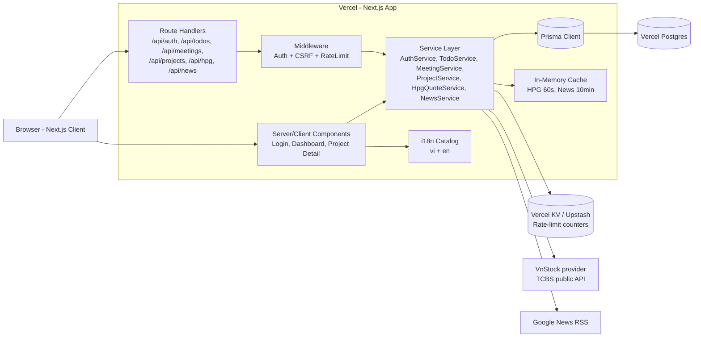
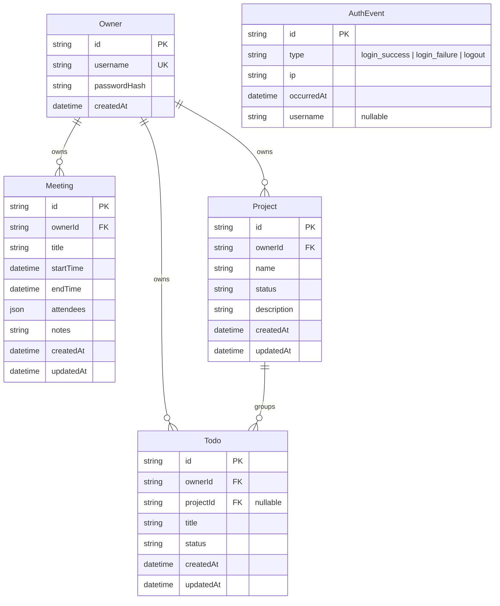

# Design Document

## Overview

Personal_Assistant_Web là một ứng dụng Next.js (App Router) được triển khai trên Vercel, phục vụ duy nhất một Owner. Toàn bộ logic phía server (xác thực, CRUD, tích hợp VnStock và Google News) được hiện thực bằng Route Handlers chạy trên Node.js runtime của Vercel. Dữ liệu nghiệp vụ (Owner, To_Do, Meeting, Project) được lưu trong Vercel Postgres và truy cập qua Prisma ORM. Frontend sử dụng React Server Components và Client Components để render Dashboard, kết hợp i18n module để hỗ trợ hai locale `vi` và `en`.

Thiết kế nhấn mạnh ba mục tiêu:

1. **An toàn cho dữ liệu cá nhân**: bcrypt hash mật khẩu, session cookie HTTP-only + Secure + SameSite=Lax, CSRF token kép, rate limit theo IP, kiểm tra ownership trên mọi bản ghi.
2. **Khả năng phục hồi với dịch vụ bên ngoài**: VnStock và Google News RSS đều có cache phía server và cờ `stale` để Dashboard không bị "trắng" khi dịch vụ ngoài lỗi.
3. **Trải nghiệm song ngữ nhất quán**: tất cả nhãn UI đi qua một i18n catalog với khóa được đảm bảo có giá trị ở cả hai locale; thời gian được format theo `Asia/Ho_Chi_Minh`.

### Nghiên cứu và quyết định kỹ thuật

- **Session management**: `iron-session` (cookie-based, ký bằng `SESSION_SECRET`) được chọn thay vì NextAuth.js vì hệ thống single-user, không cần OAuth provider, và `iron-session` tích hợp tốt với Route Handlers + Server Components mà không cần thêm bảng `Session` (Requirement 1).
- **CSRF**: Pattern *double-submit cookie* được dùng — server set cookie `csrf-token` (SameSite=Lax, HTTP-only=false) và yêu cầu mọi POST/PUT/PATCH/DELETE gửi kèm header `x-csrf-token` khớp với cookie. Pattern này phù hợp với Next.js Route Handlers và không cần thư viện ngoài (Requirement 9.3).
- **Rate limiting**: Sử dụng `@upstash/ratelimit` với Vercel KV (hoặc Upstash Redis) khi có; fallback sang in-memory LRU cho môi trường dev. Sliding window 10 phút cho login, block 15 phút sau 5 lần sai (Requirement 1.6).
- **VnStock API**: Dự án `vnstock` Python là phổ biến nhất nhưng không phù hợp Vercel Node runtime. Thay vào đó dùng endpoint công khai của TCBS hoặc SSI mà cộng đồng `vnstock-js` sử dụng (`https://apipubaws.tcbs.com.vn/stock-insight/v1/stock/bars-long-term`). Lớp `HPG_Quote_Service` đóng gói lựa chọn provider để có thể đổi mà không ảnh hưởng UI (Requirement 5).
- **Google News RSS**: URL có dạng `https://news.google.com/rss/search?q={query}+when:1d&hl={lang}&gl={country}&ceid={country}:{lang}`. Parse XML bằng `fast-xml-parser` (không phụ thuộc DOM, chạy được trên edge/node) (Requirement 6).
- **i18n**: Sử dụng `next-intl` hoặc một module nội bộ đơn giản với JSON catalog. Vì yêu cầu chỉ có 2 locale và không cần routing theo locale phức tạp, module nội bộ là đủ và giảm dependency.
- **Time formatting**: `Intl.DateTimeFormat` với `timeZone: 'Asia/Ho_Chi_Minh'` cho cả hai locale (Requirement 7.5).
- **Cache**: In-memory cache theo module-scoped Map cho HPG_Quote và News, có TTL 60s và 10 phút tương ứng. Trên Vercel serverless mỗi instance có cache riêng — chấp nhận được vì TTL ngắn và dữ liệu không nhạy cảm.

## Architecture

### Sơ đồ tổng thể



### Layered structure

1. **Presentation layer** (`app/`): Server Components fetch dữ liệu qua Service layer khi chạy SSR; Client Components dùng `fetch` đến Route Handlers cho thao tác mutate.
2. **Route Handlers** (`app/api/**/route.ts`): Validate input bằng Zod, gọi service, trả JSON.
3. **Middleware** (`middleware.ts`): Chạy trước mọi request — kiểm tra session cho route bảo vệ, áp CSRF cho method mutate, áp rate limit cho `/api/auth/login`.
4. **Service layer** (`lib/services/`): Chứa business logic thuần, không phụ thuộc Next runtime — dễ unit test và property test.
5. **Data layer** (`lib/db/`): Prisma client singleton + helper truy vấn.
6. **Integration layer** (`lib/integrations/`): Wrapper cho VnStock và Google News, có cache adapter inject được (giúp PBT mock dễ).

### Bootstrap & deployment

- `prisma migrate deploy` được gọi trong build step (`vercel-build`) trước khi serve traffic (Requirement 8.4).
- `lib/bootstrap/seedOwner.ts` chạy lazy lần đầu request đến Route Handler — kiểm tra `OWNER_USERNAME` + `OWNER_PASSWORD` env, nếu chưa có Owner thì insert với password đã hash bcrypt (Requirement 8.5).
- Config validation: `lib/config.ts` parse env qua Zod khi import; nếu thiếu biến bắt buộc, throw — middleware sẽ trả 503 + log error (Requirement 8.6).

## Components and Interfaces

Dưới đây là interface chính của từng module. Tất cả biểu diễn bằng TypeScript pseudo-code, không phải code production.

### AuthService

```ts
interface AuthService {
  login(input: { username: string; password: string; ip: string }): Promise<
    | { ok: true; sessionPayload: SessionPayload }
    | { ok: false; reason: 'invalid_credentials' | 'rate_limited' }
  >;
  logout(sessionId: string): Promise<void>;
  verifySession(cookie: string | undefined): Promise<SessionPayload | null>;
  hashPassword(plain: string): Promise<string>; // bcrypt cost >= 10
  recordLoginAttempt(ip: string, success: boolean): Promise<void>;
  isIpBlocked(ip: string): Promise<boolean>; // 5 fails / 10min => block 15min
}

type SessionPayload = { ownerId: string; issuedAt: number };
```

- Cookie: `pa_session` — HTTP-only, Secure, SameSite=Lax, max-age 8h.
- Failed-login counter key: `auth:fail:{ip}` trong KV với sliding window.

### TodoService

```ts
interface TodoService {
  create(ownerId: string, input: CreateTodoInput): Promise<Todo>;
  update(ownerId: string, id: string, patch: UpdateTodoInput): Promise<Todo>;
  delete(ownerId: string, id: string): Promise<void>;
  listForDashboard(ownerId: string): Promise<Todo[]>; // sort updated_at desc
  listByProject(ownerId: string, projectId: string): Promise<Todo[]>;
}

type CreateTodoInput = { title: string; status?: TodoStatus; projectId?: string | null };
type UpdateTodoInput = Partial<CreateTodoInput>;
type TodoStatus = 'not_started' | 'in_progress' | 'done';
```

- Validation rules (Zod): `title` 1..200 ký tự sau khi trim; `status` ∈ enum.
- Mọi method kiểm tra `record.ownerId === ownerId` trước khi thao tác.

### MeetingService

```ts
interface MeetingService {
  create(ownerId: string, input: CreateMeetingInput): Promise<Meeting>;
  update(ownerId: string, id: string, patch: UpdateMeetingInput): Promise<Meeting>;
  delete(ownerId: string, id: string): Promise<void>;
  listUpcoming(ownerId: string, now: Date): Promise<Meeting[]>; // end_time >= now, asc by start_time
}

type CreateMeetingInput = {
  title: string;
  startTime: Date;
  endTime: Date;
  attendees: string[]; // <= 50, mỗi phần tử <= 100 chars
  notes?: string | null;
};
```

- Validation: `endTime >= startTime`; `attendees.length <= 50`; mỗi phần tử `<= 100` ký tự sau trim, loại bỏ chuỗi rỗng.

### ProjectService

```ts
interface ProjectService {
  create(ownerId: string, input: CreateProjectInput): Promise<Project>;
  update(ownerId: string, id: string, patch: UpdateProjectInput): Promise<Project>;
  delete(ownerId: string, id: string): Promise<void>; // detach todos -> projectId=null, then delete
  getDetail(ownerId: string, id: string): Promise<{ project: Project; todos: Todo[] }>;
  listInProgress(ownerId: string): Promise<Project[]>; // status=in_progress, updated_at desc
}

type ProjectStatus = 'planned' | 'in_progress' | 'paused' | 'completed';
```

- `delete` thực hiện trong một Prisma transaction: `UPDATE Todo SET projectId=NULL WHERE projectId=:id`, rồi `DELETE FROM Project WHERE id=:id`.

### HpgQuoteService

```ts
interface HpgQuoteService {
  getQuote(now: Date): Promise<HpgQuoteResult>;
}

type HpgQuoteResult =
  | { ok: true; quote: HpgQuote; stale: boolean }
  | { ok: false; reason: 'unavailable' };

type HpgQuote = {
  symbol: 'HPG';
  price: number;
  change: number;
  changePercent: number;
  volume: number;
  asOfTime: Date;
  source: 'VnStock';
};
```

- Cache TTL: 60 giây dựa trên `quote.asOfTime`.
- Timeout cho upstream: 5 giây. Nếu lỗi/timeout: trả cache nếu có (kèm `stale=true`), ngược lại `ok: false`.
- Provider được inject qua interface `HpgQuoteProvider { fetch(): Promise<HpgQuote> }` — production dùng TCBS adapter, test dùng mock.

### NewsService

```ts
interface NewsService {
  getRecentNews(now: Date, locale: Locale): Promise<NewsResult>;
}

type NewsResult = { items: NewsItem[]; stale: boolean };

type NewsItem = {
  id: string; // hash(url)
  title: string;
  source: string;
  url: string;
  publishedAt: Date;
  language: 'vi' | 'en';
  category: 'politics' | 'policy';
};
```

- Truy vấn nhiều RSS URL song song — mỗi cặp (category, language) một query — gộp kết quả, deduplicate theo `url`, lọc `publishedAt >= now - 24h`, sort desc, cắt 20 phần tử.
- Cache TTL: 10 phút. Timeout per upstream: 8 giây tổng cộng.
- `News_Keyword_Set` được cấu hình tĩnh trong `lib/integrations/newsKeywords.ts`.

### I18n module

```ts
type Locale = 'vi' | 'en';
interface I18nCatalog {
  has(key: string): boolean;
  t(key: string, locale: Locale, vars?: Record<string, string | number>): string;
  formatDateTime(d: Date, locale: Locale): string; // timeZone Asia/Ho_Chi_Minh
  allKeys(): string[];
  isComplete(): boolean; // mọi key có giá trị non-empty ở vi và en
}
```

- Catalog được load từ JSON; build sẽ fail nếu `isComplete()` trả false (CI check).

### Middleware (Next.js)

```ts
async function middleware(req: NextRequest): Promise<NextResponse> {
  // 1) Reject nếu config thiếu (Requirement 8.6) -> 503
  // 2) Routes công khai: /login, /api/auth/login, asset
  // 3) Mọi route khác: yêu cầu session hợp lệ -> chuyển hướng /login (page) hoặc 401 (api)
  // 4) Nếu method ∈ {POST, PUT, PATCH, DELETE}: kiểm tra CSRF token
  // 5) Riêng /api/auth/login: kiểm tra rate limit theo IP
}
```

## Data Models

### Sơ đồ ER



### Prisma schema (rút gọn)

```prisma
model Owner {
  id           String   @id @default(cuid())
  username     String   @unique
  passwordHash String
  createdAt    DateTime @default(now())
  todos        Todo[]
  meetings     Meeting[]
  projects     Project[]
}

enum TodoStatus { not_started in_progress done }
enum ProjectStatus { planned in_progress paused completed }

model Project {
  id          String        @id @default(cuid())
  ownerId     String
  owner       Owner         @relation(fields: [ownerId], references: [id], onDelete: Cascade)
  name        String
  status      ProjectStatus @default(planned)
  description String?
  createdAt   DateTime      @default(now())
  updatedAt   DateTime      @updatedAt
  todos       Todo[]
  @@index([ownerId, status, updatedAt])
}

model Todo {
  id        String     @id @default(cuid())
  ownerId   String
  owner     Owner      @relation(fields: [ownerId], references: [id], onDelete: Cascade)
  projectId String?
  project   Project?   @relation(fields: [projectId], references: [id], onDelete: SetNull)
  title     String
  status    TodoStatus @default(not_started)
  createdAt DateTime   @default(now())
  updatedAt DateTime   @updatedAt
  @@index([ownerId, updatedAt])
  @@index([projectId, updatedAt])
}

model Meeting {
  id        String   @id @default(cuid())
  ownerId   String
  owner     Owner    @relation(fields: [ownerId], references: [id], onDelete: Cascade)
  title     String
  startTime DateTime
  endTime   DateTime
  attendees Json     // string[]
  notes     String?
  createdAt DateTime @default(now())
  updatedAt DateTime @updatedAt
  @@index([ownerId, startTime])
}

model AuthEvent {
  id         String   @id @default(cuid())
  type       String   // login_success | login_failure | logout
  ip         String
  username   String?
  occurredAt DateTime @default(now())
  @@index([occurredAt])
}
```

### Domain validation invariants

- `Todo.title`: trim length ∈ [1, 200].
- `Todo.status` ∈ `TodoStatus`.
- `Meeting.endTime >= Meeting.startTime` (DB-level CHECK constraint thêm qua migration thủ công).
- `Meeting.attendees`: array, length ≤ 50, mỗi phần tử string trim ≤ 100 ký tự, không rỗng.
- `Project.name`: trim length ≥ 1.
- `Project.status` ∈ `ProjectStatus`.
- Mọi bản ghi có `ownerId` = id của Owner duy nhất.


## Correctness Properties

*A property is a characteristic or behavior that should hold true across all valid executions of a system — essentially, a formal statement about what the system should do. Properties serve as the bridge between human-readable specifications and machine-verifiable correctness guarantees.*

Vì hệ thống có nhiều tầng logic thuần (validation, ownership, cache, i18n, định dạng thời gian), property-based testing có giá trị cao. UI rendering, deploy/config, và infrastructure được kiểm tra bằng example/snapshot/smoke test (xem mục Testing Strategy).

### Property 1: Bcrypt password hashing

*For all* plaintext password strings `p` với `1 ≤ p.length ≤ 200`, kết quả `AuthService.hashPassword(p)` là một bcrypt hash (prefix `$2`) với cost factor được nhúng `≥ 10`, thỏa mãn `bcrypt.compare(p, hash) === true`, và `hash !== p`.

**Validates: Requirements 1.4, 8.5**

### Property 2: Successful login round-trip

*For all* Owner đã được seed với cặp `(username, hash(password))`, gọi `AuthService.login({ username, password, ip })` trả về `ok: true` với `sessionPayload.ownerId` bằng id của Owner đó, và `verifySession(serialize(sessionPayload))` trả về cùng `sessionPayload`.

**Validates: Requirements 1.1**

### Property 3: Login rejects all non-matching credential pairs without leaking which field is wrong

*For all* cặp `(u, p)` mà `u !== ownerUsername` hoặc `bcrypt.compare(p, ownerHash) === false`, `AuthService.login` trả về `ok: false` với `reason === 'invalid_credentials'` (cùng một hằng số cho mọi trường hợp sai).

**Validates: Requirements 1.2**

### Property 4: Logout invalidates session

*For all* session payload `s` được phát hành bởi `login`, sau khi gọi `logout(s)` thì `verifySession(serialize(s))` trả về `null`.

**Validates: Requirements 1.5**

### Property 5: Rate-limit on failed logins

*For all* IP `ip` và mọi chuỗi gồm `n ≥ 5` lần login thất bại trong cửa sổ 10 phút, mọi lần `login` từ `ip` trong 15 phút tiếp theo đều trả về `ok: false` với `reason === 'rate_limited'`, kể cả khi credential đúng.

**Validates: Requirements 1.6**

### Property 6: Auth gate

*For all* request có path không thuộc danh sách public (`/login`, `/api/auth/login`, asset tĩnh) và không có session cookie hợp lệ, middleware trả về 401 cho path bắt đầu bằng `/api/`, hoặc 302 đến `/login` cho các path còn lại; không có request nào tới Service layer được phát sinh.

**Validates: Requirements 1.3, 9.1**

### Property 7: Ownership invariant cho mọi entity

*For all* record `r` (Todo, Meeting hoặc Project) với `r.ownerId = A`, và mọi session với `ownerId = B ≠ A`, các method `*Service.{get,update,delete,listByProject,getDetail}` đều ném lỗi `NotFound` (không phải `Forbidden`, để không tiết lộ sự tồn tại) và không thay đổi DB state.

**Validates: Requirements 9.2**

### Property 8: Single-owner uniqueness

*For all* trạng thái DB hợp lệ và mọi sequence các thao tác create/update/delete của hệ thống, tổng số bản ghi `Owner` luôn `≤ 1`; mọi `Todo`, `Meeting`, `Project` đều có `ownerId` trỏ tới Owner duy nhất đó.

**Validates: Requirements 8.5, 9.2**

### Property 9: Todo title validation

*For all* string `s`, `TodoService.create({ title: s, ... })` chấp nhận `s` *iff* `s.trim().length ∈ [1, 200]`; ngược lại ném lỗi xác thực có tham chiếu tới trường `title`.

**Validates: Requirements 2.1, 2.2**

### Property 10: Todo status enum invariant

*For all* string `s`, `TodoService.{create, update}` chấp nhận `status: s` *iff* `s ∈ TodoStatus`; ngược lại ném lỗi xác thực. Khi accept, sau thao tác, bản ghi có `status === s` và `updatedAt` mới strictly lớn hơn `updatedAt` trước đó (với `update`).

**Validates: Requirements 2.1, 2.3, 2.4**

### Property 11: Todo dashboard listing

*For all* tập các Todo (đã/chưa xóa) thuộc Owner, `TodoService.listForDashboard(ownerId)` trả về đúng tập con những Todo chưa xóa, được sắp xếp giảm dần theo `updatedAt`.

**Validates: Requirements 2.5, 2.6**

### Property 12: Project linkage on todo creation

*For all* Project `P` thuộc Owner và mọi `CreateTodoInput` có `projectId = P.id`, Todo được tạo có `projectId === P.id`. Với input mà `projectId` là `undefined` hoặc `null`, Todo được tạo có `projectId === null`.

**Validates: Requirements 2.7, 4.7**

### Property 13: Meeting time validation

*For all* cặp `(start, end)` thuộc Date, `MeetingService.{create, update}` chấp nhận *iff* `end >= start`; ngược lại ném lỗi xác thực có tham chiếu tới trường `endTime`.

**Validates: Requirements 3.1, 3.2**

### Property 14: Meeting attendees validation

*For all* mảng `attendees: string[]`, validation chấp nhận *iff* `attendees.length ≤ 50` và mọi phần tử có `trim().length ∈ [1, 100]`; ngược lại ném lỗi xác thực.

**Validates: Requirements 3.6**

### Property 15: Meeting update field allow-list

*For all* meeting và mọi patch `P`, sau `update(id, P)`, các trường ngoài `{title, startTime, endTime, attendees, notes}` không bị thay đổi, các trường còn lại bằng giá trị tương ứng trong `P` (nếu có), và `updatedAt` strictly tăng.

**Validates: Requirements 3.3**

### Property 16: Meeting upcoming listing

*For all* tập Meeting thuộc Owner và mọi Date `now`, `listUpcoming(ownerId, now)` trả về đúng tập những Meeting chưa bị xóa với `endTime >= now`, sắp xếp tăng dần theo `startTime`.

**Validates: Requirements 3.4, 3.5**

### Property 17: Project name and status validation

*For all* `CreateProjectInput`, `ProjectService.create` chấp nhận *iff* `name.trim().length ≥ 1` và (`status` không được cung cấp hoặc `status ∈ ProjectStatus`); khi `status` không cung cấp, project được lưu với `status === 'planned'`. Update trả lỗi xác thực với mọi `status` không thuộc enum, và bump `updatedAt` khi accept.

**Validates: Requirements 4.1, 4.2, 4.3**

### Property 18: Project detail consistency

*For all* Project `P` và tập Todo của Owner, `ProjectService.getDetail(ownerId, P.id).todos` chứa đúng những Todo có `projectId === P.id`, sắp xếp giảm dần theo `updatedAt`.

**Validates: Requirements 4.4**

### Property 19: Project deletion detaches todos and preserves them

*For all* Project `P` thuộc Owner và tập `T` các Todo có `projectId === P.id`, sau khi gọi `ProjectService.delete(ownerId, P.id)`:

- Không còn record Project nào với id `P.id`.
- Mọi Todo `t ∈ T` vẫn tồn tại trong DB với cùng `id`, cùng `title`, cùng `status`, và `projectId === null`.
- Tổng số Todo của Owner trước và sau thao tác bằng nhau.

**Validates: Requirements 4.5**

### Property 20: Dashboard project listing

*For all* tập Project thuộc Owner, `listInProgress(ownerId)` trả về đúng tập những Project có `status === 'in_progress'`, sắp xếp giảm dần theo `updatedAt`.

**Validates: Requirements 4.6**

### Property 21: HPG quote shape

*For all* upstream payload hợp lệ được mock, `HpgQuoteService.getQuote` trả về `ok: true` với `quote.symbol === 'HPG'`, `quote.source === 'VnStock'`, và các trường số (`price`, `change`, `changePercent`, `volume`) là số hữu hạn; `asOfTime` là Date hợp lệ.

**Validates: Requirements 5.1**

### Property 22: HPG cache TTL 60 giây

*For all* cached quote `q` và Date `now`:

- Nếu `now - q.asOfTime < 60_000ms`, lần `getQuote(now)` tiếp theo trả về `quote === q` với `stale === false` và provider không được gọi.
- Nếu `now - q.asOfTime ≥ 60_000ms`, provider được gọi đúng một lần, cache được cập nhật bằng kết quả mới.

**Validates: Requirements 5.2**

### Property 23: News cache TTL 10 phút

*For all* cached `NewsResult` `r` được fetch tại thời điểm `t` và Date `now`:

- Nếu `now - t < 600_000ms`, lần `getRecentNews(now, locale)` tiếp theo trả về `r.items` với `stale === false` và Google News không được gọi.
- Nếu `now - t ≥ 600_000ms`, Google News được gọi và cache cập nhật.

**Validates: Requirements 6.6**

### Property 24: Stale fallback khi upstream lỗi

*For all* upstream provider (VnStock hoặc Google News) ném mọi failure mode (timeout > timeout giới hạn, status `5xx`, parse error, network error):

- Nếu cache có dữ liệu, service trả về kết quả cache với `stale === true` và giữ nguyên nội dung dữ liệu.
- Nếu cache trống, `HpgQuoteService` trả về `{ ok: false, reason: 'unavailable' }`; `NewsService` trả về `{ items: [], stale: false }`.

**Validates: Requirements 5.3, 6.7**

### Property 25: News window 24h

*For all* Date `now` và mọi tập NewsItem thô từ RSS, `getRecentNews(now, locale).items` chỉ chứa item với `publishedAt >= now - 24h`.

**Validates: Requirements 6.1**

### Property 26: News deduplication

*For all* danh sách input có item trùng `url`, kết quả output chứa các URL phân biệt đôi một, và item được giữ với mỗi `url` có `publishedAt` bằng giá trị lớn nhất trong các item input có cùng `url`.

**Validates: Requirements 6.4**

### Property 27: News ordering and limit

*For all* danh sách input, `getRecentNews(...).items.length ≤ 20` và dãy `publishedAt` của output là không tăng (sắp xếp giảm dần).

**Validates: Requirements 6.5**

### Property 28: News category mapping

*For all* item `i` trong output, `i.category` bằng category của keyword group mà query đó được phát từ; với mỗi `(category, locale)` trong `News_Keyword_Set`, có ít nhất một query được issue chứa keyword tương ứng (kiểm tra qua mock fetch).

**Validates: Requirements 6.2, 6.3**

### Property 29: i18n key completeness

*For all* `key ∈ I18nCatalog.allKeys()`, cả `t(key, 'vi')` và `t(key, 'en')` trả về string khác `undefined` và có `length > 0`. Tương đương: `I18nCatalog.isComplete() === true`.

**Validates: Requirements 7.3**

### Property 30: News passthrough (no auto-translation)

*For all* `NewsItem` `i` và mọi locale `L`, component render `News_Item` chứa nguyên văn `i.title` và `i.source` (byte-for-byte) trong DOM, không thay đổi theo `L`.

**Validates: Requirements 7.4**

### Property 31: Time formatting timezone

*For all* Date `d` và locale `L ∈ {'vi', 'en'}`, `I18nCatalog.formatDateTime(d, L)` bằng kết quả của `Intl.DateTimeFormat(L, { timeZone: 'Asia/Ho_Chi_Minh', ...preset })` áp dụng cho `d`. Đặc biệt, hai Date đại diện cùng một thời điểm UTC luôn được format thành cùng chuỗi.

**Validates: Requirements 7.5**

### Property 32: CSRF protection trên mọi mutating request

*For all* `(method, path)` với `method ∈ {POST, PUT, PATCH, DELETE}` và `path` thuộc tập route bảo vệ, request không có cookie `csrf-token`, hoặc thiếu header `x-csrf-token`, hoặc header không khớp cookie, đều nhận response status `403` và service handler không được invoke.

**Validates: Requirements 9.3**

### Property 33: Owner bootstrap idempotence

*For all* `n ≥ 1` lần gọi `seedOwner()` với cùng `OWNER_USERNAME` + `OWNER_PASSWORD`, sau khi hoàn tất, DB chứa đúng một Owner có `username === OWNER_USERNAME`, và `bcrypt.compare(OWNER_PASSWORD, owner.passwordHash) === true`.

**Validates: Requirements 8.5**

### Property 34: Missing env vars => 503

*For all* tập env subset `E` thiếu ít nhất một biến bắt buộc trong `RequiredEnv`, middleware trả về response status `503` cho mọi path không thuộc allow-list dành cho health/static, và log entry chứa tên biến thiếu (không chứa giá trị nhạy cảm).

**Validates: Requirements 8.6**

### Property 35: AuthEvent logging

*For all* lần `login` (thành công hoặc thất bại) hoặc `logout`, đúng một bản ghi `AuthEvent` được tạo với `type` đúng (`login_success` / `login_failure` / `logout`), `ip` non-empty, `occurredAt` là Date hợp lệ, và payload log không chứa substring của plaintext password.

**Validates: Requirements 9.4**

## Error Handling

### Phân loại lỗi và mã trạng thái HTTP

| Loại lỗi | HTTP status | Hiển thị cho client | Server-side action |
|---|---|---|---|
| Validation (Zod) | 400 | Localized message theo locale của session | Không log thông tin nhạy cảm; log validation field name + request id |
| Unauthenticated (no/invalid session) | 401 (API) hoặc 302 → `/login` (page) | Generic "Vui lòng đăng nhập" / "Please sign in" | Log request id + path; không log session payload |
| Rate limited (login) | 429 | Localized "Quá nhiều lần thử, vui lòng thử lại sau X phút" | Log IP, count, retry-after |
| CSRF token mismatch | 403 | Generic "Yêu cầu không hợp lệ" / "Invalid request" | Log request id + path; không log token |
| Ownership violation (record.ownerId ≠ session.ownerId) | 404 | Generic "Không tìm thấy" / "Not found" (giống record không tồn tại) | Log request id + ownerId + recordId at WARN level |
| External upstream lỗi (VnStock/Google News) | 200 với `stale=true` (có cache) hoặc 200 với `unavailable=true` placeholder (không cache) | Hiển thị placeholder + chỉ báo `stale` | Log provider name, error class, duration; không retry trong cùng request |
| DB error (Prisma) | 500 | Generic "Đã có lỗi xảy ra. Vui lòng thử lại." | Log full error + stack + request id ở ERROR level; không trả chi tiết về client |
| Missing required env config | 503 | Generic "Service unavailable" | Log danh sách biến thiếu (chỉ tên) ở FATAL/ERROR; không log giá trị |
| i18n missing key | Không lỗi (graceful fallback) | Trả về chính `key` để dev nhận ra | Log warning kèm key + locale; CI build sẽ fail nếu phát hiện trong test |

### Validation errors (Zod)

- Mọi Route Handler `parse` body bằng schema Zod tương ứng. `ZodError` được map sang object `{ ok: false, error: { code: 'validation', fields: { fieldPath: messageKey } } }`.
- Frontend dùng `messageKey` để dịch sang ngôn ngữ hiện tại qua `I18nCatalog.t(messageKey, locale)`.
- Không bao giờ trả nguyên `error.message` của Zod ra client (có thể chứa chi tiết kỹ thuật).

### Auth failures

- Login sai: trả `401` + `{ error: { code: 'invalid_credentials' } }`. Cùng response cho username sai và password sai (Requirement 1.2).
- Login khi IP đang bị block: trả `429` + `{ error: { code: 'rate_limited', retryAfterSeconds } }`. Header `Retry-After` được set.
- Truy cập route bảo vệ không có session: middleware redirect `302 /login?next=<encoded>` cho HTML; trả `401 { error: { code: 'unauthenticated' } }` cho `/api/*`.

### CSRF mismatch

- Middleware kiểm tra trước handler. Khi token cookie hoặc header thiếu/khác nhau, trả `403 { error: { code: 'csrf_invalid' } }`. Handler không bao giờ chạy. Frontend tự động refresh token và retry tối đa 1 lần.

### Ownership violations

- `*Service` luôn truy vấn theo `WHERE id = :id AND ownerId = :ownerId`. Khi không tìm thấy, ném `NotFoundError`; Route Handler map sang `404 { error: { code: 'not_found' } }`. Không phân biệt giữa "không tồn tại" và "tồn tại nhưng không thuộc owner" để tránh leak (Requirement 9.2).

### External service failures

- **VnStock (HPG)**: timeout 5 giây + AbortController. Bất kỳ exception nào (timeout, 4xx/5xx, parse error) → fallback path:
  - Có cache: trả `{ ok: true, quote: cached, stale: true }` + log `WARN provider=vnstock error=<class>`.
  - Không cache: trả `{ ok: false, reason: 'unavailable' }`. UI hiển thị placeholder "—" và label "Không khả dụng / Unavailable".
- **Google News RSS**: timeout 8 giây tổng cho tất cả query song song (`Promise.allSettled` + `AbortController`). Một query lỗi không kéo cả batch xuống — kết quả từ query thành công vẫn được dedupe và trả về. Khi tất cả query lỗi:
  - Có cache: trả cache với `stale: true`.
  - Không cache: trả `{ items: [], stale: false }` (Requirement 6.7). UI hiển thị placeholder "Không có tin tức trong 24 giờ qua".
- Cả hai service không retry trong cùng request để tránh kéo dài thời gian phản hồi; lần fetch tiếp theo sẽ thử lại sau khi cache TTL hết hạn.

### DB errors

- Prisma errors được catch ở Route Handler boundary. `PrismaClientKnownRequestError` (P2025 not found, P2002 unique violation, ...) được map sang validation/404 nếu thuộc loại nghiệp vụ; phần còn lại → `500 { error: { code: 'internal' } }`.
- Log đầy đủ stack + Prisma `meta` (không chứa giá trị field) ở ERROR level kèm request id.

### Missing required env config

- `lib/config.ts` chạy lúc import (top-level). Nếu Zod parse thất bại, throw `ConfigError` chứa danh sách biến thiếu.
- Middleware bọc trong try/catch ngoài cùng: nếu phát hiện `ConfigError`, trả `503 { error: { code: 'service_unavailable', missing: [<names>] }` (chỉ tên biến) cho `/api/*`, hoặc render trang lỗi tĩnh cho HTML. Log FATAL kèm hostname (Requirement 8.6).

### i18n missing key

- `t(key, locale)` luôn trả về một string (không bao giờ `undefined`). Nếu key không có trong catalog: trả về `key` chính nó và log `WARN i18n.missing key=<k> locale=<l>`.
- CI có job `i18n:check` chạy `I18nCatalog.isComplete()` — fail build nếu có key trống ở bất kỳ locale.

### Logging strategy

- Logger: `pino` (hoặc `console` JSON wrapper trên Vercel) với mức `debug`, `info`, `warn`, `error`, `fatal`.
- Mỗi log entry có: `level`, `msg`, `requestId`, `path`, `method`, `ownerId` (nếu có session), `ip` (cho auth events), `latencyMs`.
- **PII / secret allow-list**: KHÔNG log `password`, `passwordHash`, `csrf-token`, `pa_session` cookie, body của login request, env values. Helper `redact(payload, fields)` được dùng trước mọi log call có chứa request body.
- AuthEvent (Requirement 9.4) được lưu vào DB *bên cạnh* logger để có audit trail bền vững — DB row chỉ chứa `type`, `ip`, `username` (cho `login_failure`/`login_success`/`logout`), `occurredAt`. Không lưu password.
- Lỗi không xác định ở Route Handler được wrap bởi một top-level error boundary để đảm bảo không có stack trace nào lọt ra response body.

## Testing Strategy

### Mục tiêu phủ test

- Unit test cho từng Service với mock dependency (Prisma, providers, KV).
- Property-based test cho mọi property trong mục Correctness Properties.
- Integration test cho Route Handlers chạy với DB thực (Prisma + SQLite hoặc Postgres test container).
- End-to-end smoke test cho luồng người dùng chính.
- CI guardrails: lint, typecheck, prisma migrate dry-run, i18n completeness check, test suite.

### Tooling

| Mục đích | Lựa chọn |
|---|---|
| Test runner | `vitest` (chạy `--run` trong CI; không dùng watch mode) |
| Property-based testing | `fast-check` (≥100 iterations / property) |
| Mocking | `vi.mock`, `vi.fn` của vitest |
| HTTP test cho Route Handlers | `node-fetch` qua `next-test-api-route-handler`, hoặc gọi handler trực tiếp với `Request` mocked |
| DB test | Prisma + SQLite in-memory (cho unit/integration tốc độ cao) **hoặc** Postgres test container qua `testcontainers` (cho integration sát production) — chọn một, ưu tiên Postgres khi CI cho phép |
| E2E | `playwright` chạy headless |
| i18n check | Script `scripts/check-i18n.ts` chạy `I18nCatalog.isComplete()` |

### Unit tests cho Service layer

Mỗi service có file test riêng dưới `lib/services/__tests__/`:

- `AuthService.spec.ts`: hashPassword (cost ≥ 10), login (success/fail/rate-limited), logout, verifySession, recordLoginAttempt, isIpBlocked. Mock `bcrypt`, `KV`, `prisma.owner`.
- `TodoService.spec.ts`: create/update/delete/listForDashboard/listByProject với Prisma mocked. Test ownership rejection, validation rejection.
- `MeetingService.spec.ts`: tương tự, đặc biệt focus end_time >= start_time và attendees length/element length.
- `ProjectService.spec.ts`: focus delete transaction (todos detached → projectId=null trước khi xóa).
- `HpgQuoteService.spec.ts`: cache TTL, stale fallback, provider error handling. Provider mocked qua interface `HpgQuoteProvider`.
- `NewsService.spec.ts`: keyword fan-out, dedupe, sort, 24h window, cache TTL 10 phút, stale fallback. `fetch` được mock.

### Property-based tests

Mỗi property trong mục **Correctness Properties** có một file `*.property.spec.ts` với cấu hình `fc.assert(prop, { numRuns: 100 })`. Tag comment phía trên mỗi property test:

```ts
// Feature: personal-assistant-web, Property 19: Project deletion detaches todos and preserves them
```

Generator chính (`lib/testing/generators.ts`):

- `genTitle`: string trim length ∈ [1, 200], gồm cả Unicode + whitespace.
- `genWhitespaceTitle`: string toàn whitespace hoặc rỗng (negative case cho 9).
- `genTodoStatus` / `genProjectStatus`: oneof enum.
- `genInvalidStatus`: string ngoài enum.
- `genMeetingTimes`: cặp `(start, end)` với end >= start, và biến thể negative end < start.
- `genAttendees`: array string (length 0..60, mỗi phần tử length 0..120) — validator phải reject khi vi phạm.
- `genNewsItem`: id, url, publishedAt trong/ngoài window 24h.
- `genDate` quanh "now" cho cache TTL test.

Chiến lược shrink: dùng generator chuẩn của `fast-check` (`fc.string`, `fc.array`, `fc.date`); với property liên quan tới timing (5, 22, 23), dùng `fc.context()` + clock injection (`now` là tham số) để deterministic.

Property test cho cache (Property 22, 23) inject một `Clock` interface (`{ now(): Date }`) và một `MockProvider` đếm số lần gọi — assert đúng 0/1 lần gọi tùy điều kiện.

Property test cho ownership (Property 7, 8): dùng setup tạo 2 owner giả lập (A, B), seed records của A, rồi gọi service với session B — mọi call phải ném NotFound.

Property test cho i18n (Property 29): chạy qua `allKeys()`, không cần `fast-check` (đã universal trên tập key); nhưng vẫn dùng `fc.assert` để có report nhất quán.

### Integration tests cho Route Handlers

Đặt dưới `app/api/**/__tests__/*.int.spec.ts`:

- Mỗi suite chạy với một DB sạch (Prisma + SQLite in-memory hoặc Postgres test container). Setup: `prisma migrate deploy` → seed 1 Owner + CSRF token.
- Test cases:
  - `POST /api/auth/login` happy path + sai mật khẩu + IP bị block (5 lần fail).
  - `POST /api/todos` thiếu CSRF → 403; có CSRF + session → 200; với owner khác → 404.
  - `PUT /api/todos/:id` validation lỗi → 400 với localized message.
  - `DELETE /api/projects/:id` → tất cả todos liên kết có `projectId === null` sau request (kiểm tra trực tiếp DB).
  - `GET /api/hpg` với mock VnStock → trả quote + cache reuse trên request thứ 2 (mock chỉ gọi 1 lần).
  - `GET /api/news` với mock RSS → trả ≤ 20 item, dedupe, 24h.
- Request được tạo qua helper `makeRequest({ method, path, session, csrf, body })`.

### End-to-end smoke tests (Playwright)

`e2e/smoke.spec.ts` chạy luồng:

1. Truy cập `/` không session → redirect `/login`.
2. Login với credential từ env test.
3. Dashboard hiển thị tiêu đề + 4 widget (Todos, Meetings, Projects, HPG, News). Khẳng định locale mặc định là `vi`.
4. Tạo Todo, kiểm tra hiển thị trong list.
5. Tạo Meeting (start, end), kiểm tra hiển thị trong upcoming.
6. Mở chi tiết Project, tạo Todo trong Project, verify todo có `projectId` đúng.
7. Đổi locale sang `en`, verify nhãn UI thay đổi nhưng news titles không đổi.
8. Logout → redirect `/login`.

E2E chạy với mock VnStock + Google News (qua MSW hoặc fixture file) để smoke không phụ thuộc upstream thực.

### Test data isolation

- **Unit/property tests**: thuần in-memory, không chạm DB; mỗi test khởi tạo state mới.
- **Integration tests**: bắt đầu mỗi test bằng `BEGIN` transaction, kết thúc bằng `ROLLBACK` (Prisma `$transaction` pattern), hoặc xóa DB và migrate lại giữa các test suite. Không có shared mutable state giữa tests.
- **E2E**: dùng DB riêng `_test` được wipe + migrate trước mỗi run. Owner test seed bằng env test.
- Tất cả test set `TZ=Asia/Ho_Chi_Minh` trong env runner để tránh sai lệch khi chạy trên máy khác timezone.

### CI checks

GitHub Actions / Vercel CI thực hiện theo thứ tự:

1. `pnpm install --frozen-lockfile`
2. `pnpm lint` (ESLint + prettier check)
3. `pnpm typecheck` (`tsc --noEmit`)
4. `pnpm prisma migrate diff --from-schema-datamodel prisma/schema.prisma --to-empty --exit-code` (dry-run, đảm bảo schema sync với migration files)
5. `pnpm i18n:check` (chạy `I18nCatalog.isComplete()`, fail nếu có key trống)
6. `pnpm test --run` (vitest unit + property + integration; `numRuns=100` mỗi property)
7. `pnpm e2e --project=chromium` (Playwright)

Build chỉ được phép chạy khi tất cả check pass. Kết quả test được cache theo lockfile + schema hash để tăng tốc trên PR.
